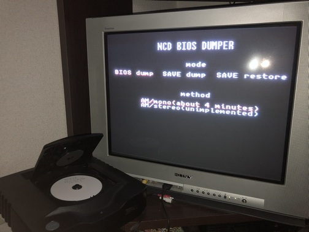
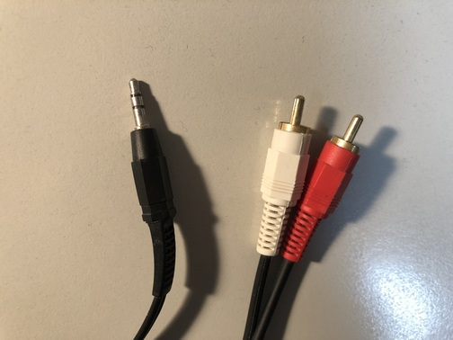
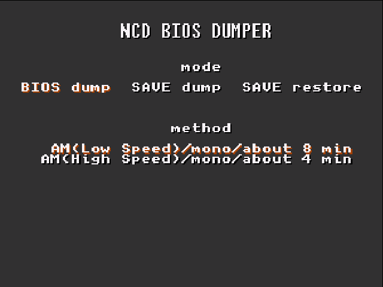
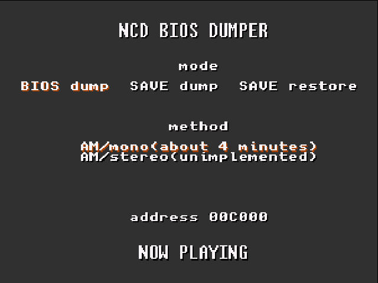
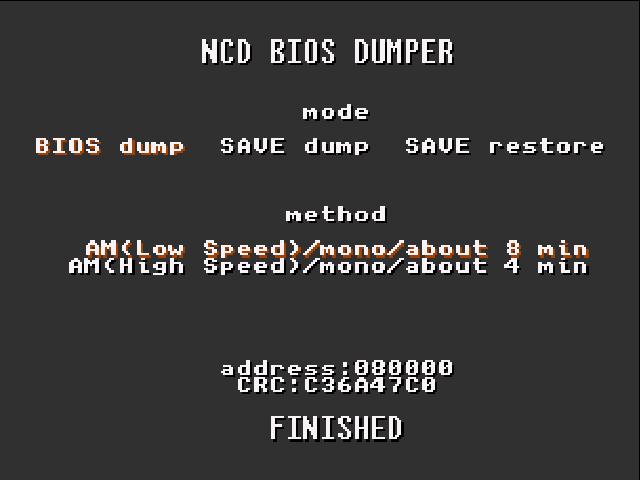
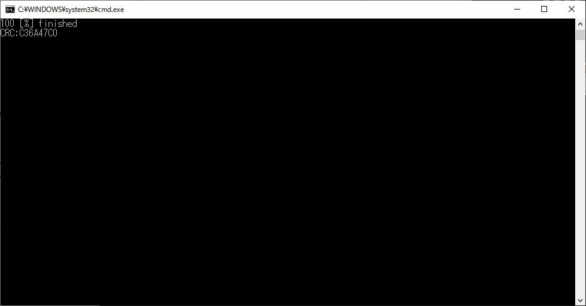
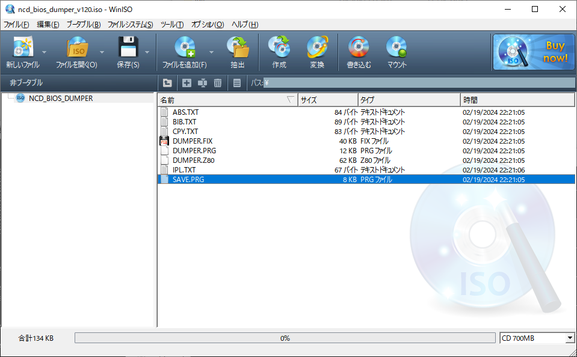
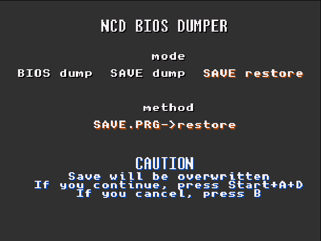
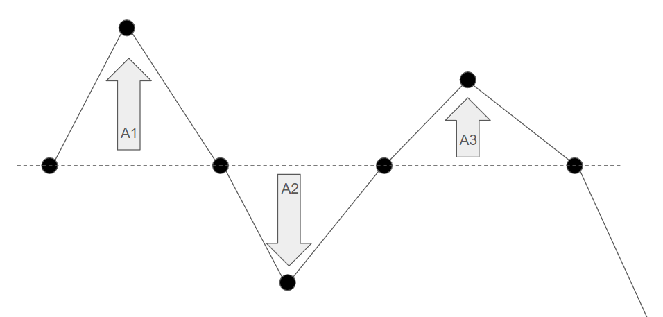

# ncd-bios-dumper

ネオジオCD上で動作するプログラムであり、BIOSを音声信号に変調して出力することをコンセプトに作成しています。  
なお、現状はあくまで試作段階で精度が低いです。動けばラッキーくらいで考えてください。  
  

## 始める前に

本当にネオジオCDのBIOSを吸い出す必要がありますか？  
エミュレータなどで使用するのであれば、UNIVERSE BIOS等の互換BIOSを使用した方が圧倒的に楽です。  

次に、ネオジオCD実機でのCD-R読み込みについて。  
ネオジオCDでCD-R読み込みをはじくためのプロテクトがかかっているという話は聞いたことがないので、おそらくどのバージョンの本体でも読み込めると思います。（homebrewソフトについての話。一部の製品版ゲームはコピーすると実機上では動かないようにプロテクトがかけられているそうですが、今回は関係ありません。）  
しかし、一般的にCD-Rの読み取りはプレスされたCDに比べて若干強いレーザー出力が必要です。へたっているドライブではCD-Rが読めないかもしれません。  
**CD-Rが読み込めるネオジオCDをご準備ください**  

参考:
[The NeoGeo Development Wiki Burning CDs](https://wiki.neogeodev.org/index.php?title=Burning_CDs#Reading_problems)  

## BIOS/SAVEのダンプ手順

1. CD-Rを焼く  
最新版ReleaseのzipからCDimage/ncd_bios_dumper.isoあるいはcueからCDライティングソフトでCD-Rに焼いてください。  
2. 録音環境を整える  
ネオジオCDから音声を録音できるようにしてください。例えば、下記写真のようなRCA-ステレオピンプラグのケーブルを使って、録音機器かPCのLine-In端子などに入力します。  
  
3. CD-RからネオジオCDを起動  
下記のような画面で起動します。  
  
左右でBIOSダンプ/SAVEダンプ/SAVEリストアのモードを切り替えます。  
上下で出力音声の変調方式を選択します。  
"AM(High Speed)/mono"あるいは"AM(Low Speed)/mono"でAボタンを押すと再生が始まります。再生時間は約4分or約8分です。
High Speedの方が再生時間が短いですが安定性が低いです。Low Speedの方を推奨します。  
  
4. 録音  
***人間が聞く用の音にはなっていないため、スピーカーから再生されないようにご注意ください***  
録音機器orソフトは下記仕様を満たせれば任意のもので構いません。参考までに、私はwin-pcでAudacityを使用して録音しました。  
1度、試しに再生して8割程度(リニア)の音量になるように再生音量か録音音量を調整してください。  
デコーダー側である程度は自動的に音量調整しますので厳密でなくて良いですが、クリップ（録音時の最大音量超過）は起きないように注意してください  
録音形式として下記の形式で録音してください。  

+ サンプリング周波数(High Speed): 96kHz以上(192kHz推奨)
+ サンプリング周波数(Low Speed): 44.1kHz以上
+ 量子化ビット数: 16bit
+ 形式: WAVE(リニアPCM)

5. 録音終了とCRCの確認
画面下部にFINISHEDと出たら終了です。終了時には下記のような画面になります。  
"CRC:"の部分の値をメモしておいてください。  

  
6. デコード  
最新版ReleaseのzipからDecoder/nbd_decoder.exeを用いてデコードします。  

```plaintext
nbd_decoder.exe -m [mode] [in.wav] [out.bin]
  mode:am_mono_high am_mono_low
```

High Speedの場合は"am_mono_high"を、Low Speedの場合は"am_mono_low"を選択します。  
デコード後には下記画面のようにデコードファイルのCRCが出力されます。これがネオジオCD本体側の画面で出たものと同じであれば、正しくデコードできています。  
  
  
出力されたbinファイルがネオジオCDのBIOSです。変調方式が良くないので、精度はよくありません。  
Low Speedで何度かやってみたり、録音環境を見直しても間違っていたら諦めてください・・・。  
  
デコーダーのソースは別リポジトリ（[nbd-decoder](https://github.com/scrap-a/nbd-decoder)）で公開しています。  

## SAVEのリストア手順

1. isoの中のセーブファイルを書き換える
最新版ReleaseのzipからCDimage/ncd_bios_dumper.isoを取り出し、isoファイルの中身を編集できるソフトウェア（例えばWinISO）で、イメージ内のSAVE.PRGを、リストアしたいセーブファイルで上書きします。  

2. CD-Rを焼く  
ncd_bios_dumper.isoあるいはcueからCDライティングソフトでCD-Rに焼いてください。  
3. CD-RからネオジオCDを起動  
下記のような画面で起動します。  
  
左右でSAVEリストアのモードを切り替え、Aで決定します。  
4. SAVEリストアの確認画面
操作ミスで実機のSAVEが上書きされないように、警告として下記のような画面が出ます。  
画面の指示に従ってください。  
  
  
## 開発環境

開発環境として[ngdevkit](https://github.com/dciabrin/ngdevkit)を使用しています。  
また、ソースやリソースにngdevkitのサンプルコードである[ngdevkit-examples](https://github.com/dciabrin/ngdevkit-examples)を使用しています。  
そのためライセンスは[ngdevkit-examples](https://github.com/dciabrin/ngdevkit-examples)(GPL3.0)に従います。  
なお、使用しているngdevkitのバージョンが古い(2023年2月頃？)ため、最新のngdevkit環境ではビルドできません。そのうち更新します。  

## 変調方式

一応、変調方式で分類するとすれば振幅変調(Amplitude Modulation/AM)にあたりますが、振幅変調を名乗るのはおこがましいくらいの原始的な方法で変調しています。  
BIOSのデータに応じて、下記画像の各サンプル(黒丸)の振幅(A1,A2,A3)の大きさを変更しています。1つの振幅あたり2bitの情報を符号化しています。  
  

## ToDo

+ 最新の[ngdevkit](https://github.com/dciabrin/ngdevkit)環境へ移行
+ ステレオ出力への対応(高速化)
+ KCSやSCSなどの従来よく使われていた変調方式への対応(安定化)

なお、更新を保証する訳ではありません。やる気次第です。  

## （参考）Neo CD SD Loaderで使用できるか？

使用できますが、[Neo CD SD Loader](http://furrtek.free.fr/sdloader/)はBIOSにパッチを当てるため、結果的に正しいBIOSは吸い出せません。  
Neo CD SD LoaderでBIOSを吸い出すには、下記の記事を参照してください。  
  
[Neo CD SD Loaderを使ってネオジオCDのBIOSをダンプする - 発明の友](http://blog.livedoor.jp/scrap_a/archives/36821052.html)  